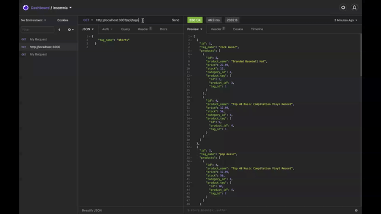

# 13 Object-Relational Mapping (ORM): E-Commerce Back End

# Description 

Build the backend for an e-commerce site.  Take a working Express.js API and configure it to use Sequelize to interact with MySQL database. 

# Table of Contents

1. [Description](#Description)
2. [Features](#Features)
3. [License](#License)
4. [Contributing](#Contributing)
5. [Questions](#Questions)
6. [Demo](#Demo)
7. [Badges](#Badges)

## Features
- Express.js
- Node.js
- NPM
- MySQL
- Sequelize

# License

## This application is covered by the MIT license. 

# Contributing
Contributions are excepted. Fill free to fork. 

# Questions
## GitHub User name 
jmnfire

### Link to GitHub:
https://github.com/jmnfire/13-E-Commerce-Back-End

### Email address 
jovan.m.nixon@gmail.com

# Demo

## Create Schema and Seed data

## GET routes to return all Categories, all products

## GET routes to return a a single category, product and tag

## POST, PUT, and DELETE routes for categories 

## POST, PUT, and DELETE routes for tags

## POST, PUT, and DELETE routes for products

# Badges

